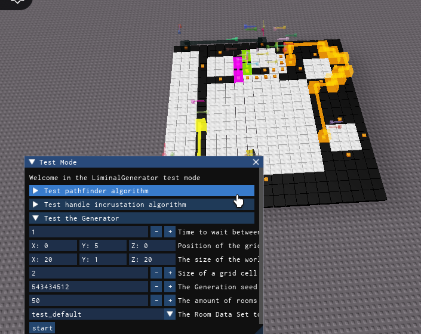
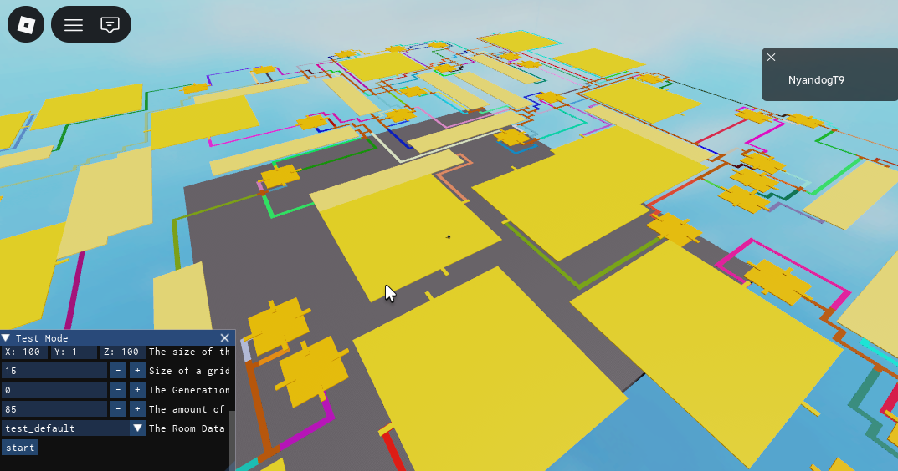

⚠⚠ It is not finished yet, do not use it as it may still have some little problems

#Liminal Generator

This programm is an algorithm coded in luau that creates arrays of 2d predefined rooms and corridor joining them together. You can control the amount of rooms, the size of the world and other parameters.

You can feed it a seed to generate the world and a room set (your predefined rooms)

Here are some generations I got:

